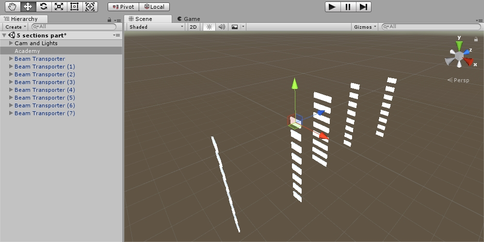

# Linear Accelerator Tuning
This repo contains the Unity3D project that addresses the task of linear accelerator beam trajectory tuning using Reinforcement Learning.  
The work was performed within the research on particle transport channel ways of automation in the Institute of Nuclear Physics.

**The WebGL live version is avaliable [here](https://entrack.github.io/linear-accelerator-tuning/).**


### Environment
The environment was built using several elements as the representation of a magnetic lens that change the trajectory of the beam. A positive reward was given if the beam hit the element (while increasing from the initial to the last one) and also increased based on the proximity to the center of the element. The agent was also given a constant penalty and the max number of iterations per episode was constrained to be _2000_.


### Training
The training was performed using the ML-Agents implementation of the PPO algorithm. As you can see from the illustration below, cumulative reward stops increasing and agent converges while reaching the maximum possible value at 35k iterations.


The config that was added to the _trainer_config.yaml_:
```
AcceleratorLearning:
    normalize: true
    num_epoch: 3
    time_horizon: 1000
    batch_size: 2024
    buffer_size: 20240
    gamma: 0.995
    max_steps: 1e6
    summary_freq: 1000
    num_layers: 3
    use_curiosity: true
    learning_rate: 1e-3
```

### Environment rationale
The reason behind the simplicity of the virtual model used for training lies in the fact that both the emulated data and the experiment, indicates that **linear beam approximation to be appropriate**.  
The hypothesis was that the cross-section beam intensity distribution will have only one area of maximum value and that it will not have drastic spikes (excluding regular noise). The collected and visualized data is provided below.


